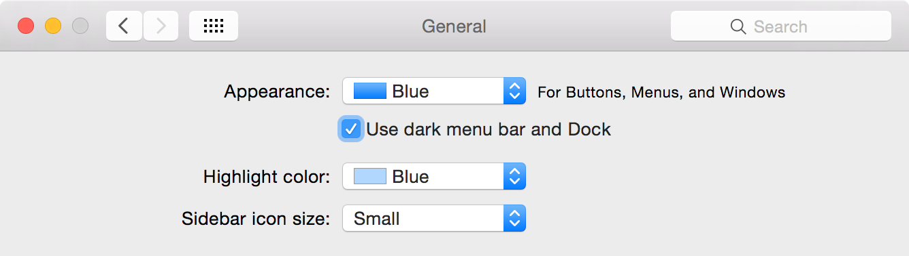

If you read [Electron's `NativeImage` docs](https://github.com/atom/electron/blob/master/docs/api/native-image.md), you'll see a mention to *template images*:

> Template images consist of black and clear colors (and an alpha channel). Template images are not intended to be used as standalone images and are usually mixed with other content to create the desired final appearance.
>
> The most common case is to use template images for a menu bar icon so it can adapt to both light and dark menu bars.
>
> **Note:** Template image is only supported on OS X.

If you are not a Mac OS X user that may sound a bit cryptic, so let's look at an example.


## A Simple App

Say we have an extremely simple app with a window and a tray icon:

```js
var path = require('path')
var app = require('app')
var Tray = require('tray')
var BrowserWindow = require('browser-window')

var tray = null
var win = null

var createTray = function () {
  var iconPath = path.resolve(__dirname, 'resources/Icon.png')

  tray = new Tray(iconPath)
}

var createWindow = function () {
  var winUrl = 'file://' + path.resolve(__dirname, 'index.html')

  win = new BrowserWindow({width: 800, height: 600})
  win.loadUrl(winUrl)
}

app.on('window-all-closed', function () {
  app.quit()
})

app.on('ready', function () {
  createTray()
  createWindow()
})
```

Our tray icon, `Icon.png`, is a 22x22 image that only has black pixels with varying opacities:


When we run the app, everything looks fine:


So job's a good'un, right?


## Enter Dark Mode

You may have missed an option in the *General* preferences pane of newer Mac OS X releases that lets you use a dark menu bar:



I wonder what happens when we turn that on...


Oops, our tray icon is invisible!


## Template Images to the Rescue

Don't worry, the fix doesn't involve detecting when the user enters dark mode and switching the tray icon for an alternate one. We just need to rename the icon to something ending in `Template`, like `IconTemplate.png`, and we are done:

```js
var createTray = function () {
  var iconPath = path.resolve(__dirname, 'resources/IconTemplate.png')

  tray = new Tray(iconPath)
}
```

Everything should look fine now:


## High Resolution

The [Human Interface Guidelines for Toolbar Items](https://developer.apple.com/library/mac/documentation/UserExperience/Conceptual/OSXHIGuidelines/ToolbarIcons.html) mention that, if a template image is provided in PDF format, OS X automatically scales it for high-resolution displays. Electron doesn't currently support PDF images, so you should instead provide higher-resolution versions of the image with their corresponding suffix, all in the same location, like this:

* `resources/IconTemplate.png`
* `resources/IconTemplate@2x.png`

One of the applications we develop in the **Discover Electron** book, [Electric Hum](https://github.com/DiscoverElectron/electric-hum/), makes use of all of this, so feel free to check it out.
