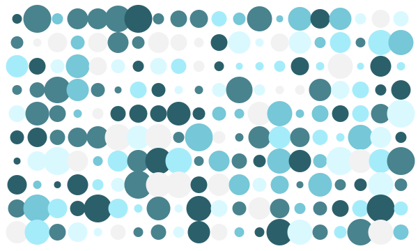

This document is a guide to the styles and patterns used throughout the site. Parts of it are attributable to [Dave Shea](http://www.mezzoblue.com/) and [Paul Robert Lloyd](http://www.paulrobertlloyd.com/).


## Title

The main page header of this guide is an `h1` element. Any header elements may include links.


## Sections

The secondary header above is an `h2` element, which may be used for any form of important page-level header. Consider using an `h2` unless you need a header level of less importance, or as a sub-header to an existing `h2` element.

### Third-Level Header

The header above is an `h3` element, which may be used for any form of page-level header which falls below the `h2` header in a document hierarchy.

#### Fourth-Level Header

The header above is an `h4` element, which may be used for any form of page-level header which falls below the `h3` header in a document hierarchy.

##### Fifth-Level Header

The header above is an `h5` element, which may be used for any form of page-level header which falls below the `h4` header in a document hierarchy.

###### Sixth-Level Header

The header above is an `h6` element, which may be used for any form of page-level header which falls below the `h5` header in a document hierarchy.


## Structural Elements

### Paragraphs

All paragraphs are wrapped in `p` tags. Additionally, `p` elements can be wrapped with a `blockquote` element if the `p` element is indeed a quote.

### Blockquotes

The `blockquote` element represents a section that is being quoted from another source:

> Many forms of Government have been tried, and will be tried in this world of sin and woe. No one pretends that democracy is perfect or all-wise. Indeed, it has been said that democracy is the worst form of government except all those other forms that have been tried from time to time.
>
> --- Winston Churchill, in [a speech to the House of Commons](http://hansard.millbanksystems.com/commons/1947/nov/11/parliament-bill#column_206) (11th November 1947)

### Horizontal Rules

The `hr` element represents a paragraph-level thematic break, e.g. a scene change in a story, or a transition to another topic within a section of a reference book. The following extract from *Pandora's Star* by Peter F. Hamilton shows two paragraphs that precede a scene change and the paragraph that follows it:

> Dudley was ninety-two, in his second life, and fast approaching time for another rejuvenation. Despite his body having the physical age of a standard fifty-year-old, the prospect of a long degrading campaign within academia was one he regarded with dread. For a supposedly advanced civilization, the Intersolar Commonwearth could be appallingly backward at times, not to mention cruel.
>
> *Maybe it won't be that bad*, he told himself. The lie was comforting enough to get him through the rest of the night's shift.
>
> * * *
>
> The Carlton AllLander drove Dudley home just after dawn. Like the astronomer, the vehicle was old and worn, but perfectly capable of doing its job. It had a cheap diesel engine, common enough on a semi-frontier world like Gralmond, although its drive array was a thoroughly modern photoneural processor. With its high suspension and deep-tread tyres it could plough along the dirt track to the observatory in all weather and seasons, including the metre-deep snow of Gralmond's winters.


## List Elements

### Ordered Lists

The `ol` element denotes an ordered list, and various numbering schemes are available through CSS (including 1,2,3... i,ii,iii... a,b,c... and so on). Each item requires a surrounding `li` tag, to denote individual items within the list.

Here is an example list showing the monarchs of Great Britain and the United Kingdom:

1. House of Stuart
   1. Anne
2. House of Hanover
   1. George I
   2. George II
   3. George III
   4. George IV
   5. William IV
   6. Victoria
3. House of Saxe-Coburg and Gotha
   1. Edward VII
4. House of Windsor
   1. George V
   2. Edward VIII
   3. George VI
   4. Elizabeth II

### Unordered Lists

The `ul` element denotes an unordered list (i.e. a list of loose items that don't require numbering, or a bulleted list). Again, each item requires a surrounding `li` tag, to denote individual items.

Here is an example list showing the constituent parts of the British Isles:

* United Kingdom of Great Britain and Northern Ireland:
  * England
  * Scotland
  * Wales
  * Northern Ireland
* Republic of Ireland
* Isle of Man
* Channel Islands:
  * Bailiwick of Guernsey
  * Bailiwick of Jersey

Sometimes you may want each list item to contain block elements, typically a paragraph or two:

* The British Isles is an archipelago consisting of the two large islands of Great Britain and Ireland, and many smaller surrounding islands.

* Great Britain is the largest island of the archipelago. Ireland is the second largest island of the archipelago and lies directly to the west of Great Britain.

* The full list of islands in the British Isles includes over 1,000 islands, of which 51 have an area larger than 20 km^2^.

### Definition Lists

The `dl` element is for another type of list called a definition list. Instead of list items, the content of a `dl` consists of `dt` (definition term) and `dd` (definition description) pairs. Though it may be called a "definition list", `dl` can apply to other scenarios where a parent/child relationship is applicable. For example, it may be used for marking up dialogues, with each `dt` naming a speaker, and each `dd` containing his or her words:

Romeo
: Have not saints lips, and holy palmers too?

Juliet
: Ay, pilgrim, lips that they must use in prayer.


## Table Elements

Tables should be used when displaying tabular data. The `thead`, `tfoot` and `tbody` elements enable you to group rows within each table.

If you use these elements, you must use every element. They should appear in this order: `thead`, `tfoot` and `tbody`, so that browsers can render the foot before receiving all the data. You must use these tags within the `table` element.

Example with Team GB's London 2012 medal table:

<div class="overflow">
<table>
  <thead>
    <tr>
      <th style="text-align: left">Sport</th>
      <th>Gold</th>
      <th>Silver</th>
      <th>Bronze</th>
      <th>Total</th>
    </tr>
  </thead>
  <tbody>
    <tr>
      <td style="text-align: left">Athletics</td>
      <td>4</td>
      <td>1</td>
      <td>1</td>
      <td>6</td>
    </tr>
    <tr>
      <td style="text-align: left">Boxing</td>
      <td>3</td>
      <td>1</td>
      <td>1</td>
      <td>5</td>
    </tr>
    <tr>
      <td style="text-align: left">Canoe Slalom</td>
      <td>1</td>
      <td>1</td>
      <td>0</td>
      <td>2</td>
    </tr>
    <tr>
      <td style="text-align: left">Canoe Sprint</td>
      <td>1</td>
      <td>0</td>
      <td>1</td>
      <td>2</td>
    </tr>
    <tr>
      <td style="text-align: left">Cycling - Road</td>
      <td>1</td>
      <td>1</td>
      <td>1</td>
      <td>3</td>
    </tr>
    <tr>
      <td style="text-align: left">Cycling - Track</td>
      <td>7</td>
      <td>1</td>
      <td>1</td>
      <td>9</td>
    </tr>
    <tr>
      <td style="text-align: left">Diving</td>
      <td>0</td>
      <td>0</td>
      <td>1</td>
      <td>1</td>
    </tr>
    <tr>
      <td style="text-align: left">Equestrian</td>
      <td>3</td>
      <td>1</td>
      <td>1</td>
      <td>5</td>
    </tr>
    <tr>
      <td style="text-align: left">Gymnastics - Artistic</td>
      <td>0</td>
      <td>1</td>
      <td>3</td>
      <td>4</td>
    </tr>
    <tr>
      <td style="text-align: left">Hockey</td>
      <td>0</td>
      <td>0</td>
      <td>1</td>
      <td>1</td>
    </tr>
    <tr>
      <td style="text-align: left">Judo</td>
      <td>0</td>
      <td>1</td>
      <td>1</td>
      <td>2</td>
    </tr>
    <tr>
      <td style="text-align: left">Modern Pentathlon</td>
      <td>0</td>
      <td>1</td>
      <td>0</td>
      <td>1</td>
    </tr>
    <tr>
      <td style="text-align: left">Rowing</td>
      <td>4</td>
      <td>2</td>
      <td>3</td>
      <td>9</td>
    </tr>
    <tr>
      <td style="text-align: left">Sailing</td>
      <td>1</td>
      <td>4</td>
      <td>0</td>
      <td>5</td>
    </tr>
    <tr>
      <td style="text-align: left">Shooting</td>
      <td>1</td>
      <td>0</td>
      <td>0</td>
      <td>1</td>
    </tr>
    <tr>
      <td style="text-align: left">Swimming</td>
      <td>0</td>
      <td>1</td>
      <td>2</td>
      <td>3</td>
    </tr>
    <tr>
      <td style="text-align: left">Tennis</td>
      <td>1</td>
      <td>1</td>
      <td>0</td>
      <td>2</td>
    </tr>
    <tr>
      <td style="text-align: left">Taekwondo</td>
      <td>1</td>
      <td>0</td>
      <td>1</td>
      <td>2</td>
    </tr>
    <tr>
      <td style="text-align: left">Triathlon</td>
      <td>1</td>
      <td>0</td>
      <td>1</td>
      <td>2</td>
    </tr>
  </tbody>
  <tfoot>
    <tr>
      <td style="text-align: left">Total</td>
      <td>29</td>
      <td>17</td>
      <td>19</td>
      <td>65</td>
    </tr>
  </tfoot>
</table>
</div>

## Media Elements

<script src="grid.js"></script>

### Image

The `img` element represents an image:



### Canvas

The `canvas` element allows for dynamic, scriptable rendering of 2D shapes and bitmap images:

<canvas id="grid-target" class="interactive target bordered">
  Your browser does not support canvas.
</canvas>

<script>
  var g = Object.create(grid);
  g.init(document.getElementById('grid-target'), {
    width:  600,
    height: 360,
    colors: ['#2B606B', '#49838E', '#76C7D7', '#A5ECFA', '#D9F9FF', '#F2F2F2']
  })
  g.start();
</script>


## Text Formatting Elements

### Links and Anchors

The `a` element is used to hyperlink text, be that to another page, a named fragment on the current page or any other location on the web. Example:

[Go to the home page](/) or [return to the top of this page](#top).

### Stressed Emphasis

The `em` element is used to denote text with stressed emphasis, i.e. something you'd pronounce differently. Where italicizing is required for stylistic differentiation, the `i` element may be preferable. Example:

You simply *must* try the negitoro maki!

### Strong Importance

The `strong` element is used to denote text with strong importance. Where bolding is used for stylistic differentiation, the `b` element may be preferable. Example:

**Don't** stick nails in the electrical outlet.

### Italicised

The `i` element is used for text in an alternate voice or mood, or otherwise offset from the normal prose. Examples include taxonomic designations, technical terms, idiomatic phrases from another language, the name of a ship or other spans of text whose typographic presentation is typically italicised. Example:

There is a certain <i>je ne sais quoi</i> in the air.

### Emboldened

The `b` element is used for text stylistically offset from normal prose without conveying extra importance, such as key words in a document abstract, product names in a review, or other spans of text whose typographic presentation is typically emboldened. Example:

You enter a small room. Your <b>sword</b> glows brighter. A **rat** scurries past the corner wall.

### Inline Quotes

The `q` element is used for quoting text inline. Example showing nested quotations:

John said, <q>I saw Lucy at lunch, she told me <q>Mary wants you to get some ice cream on your way home</q>. I think I will get some at Ben and Jerry's, on Gloucester Road.</q>

### Abbreviations

The `abbr` element is used for any abbreviated text, whether it be acronym, initialism, or otherwise. Generally, it's less work and useful (enough) to mark up only the first occurrence of any particular abbreviation on a page, and ignore the rest. Any text in the `title` attribute will appear when the user's mouse hovers the abbreviation (although, notably, this does not work in Internet Explorer for Windows). Example:

Get the latest news from the [BBC](http://www.bbc.co.uk/) in Stoke and Staffs.

*[BBC]:    British Broadcasting Corporation
*[Staffs]: Staffordshire

### Definitions

The `dfn` element is used to highlight the first use of a term. The `title` attribute can be used to describe the term. Example:

Bob's <dfn title="Dog">canine</dfn> mother and <dfn title="Horse">equine</dfn> father sat him down and carefully explained that he was an <dfn title="A mutation that combines two or more sets of chromosomes from different species">allopolyploid</dfn> organism.

### Citations

The `cite` element is used to represent the title of a work (e.g. a book, essay, poem, song, film, TV show, sculpture, painting, musical, exhibition, etc.). This can be a work that is being quoted or referenced in detail (i.e. a citation), or it can just be a work that is mentioned in passing. Example:

<cite>Universal Declaration of Human Rights</cite>, United Nations, December 1948. Adopted by General Assembly resolution 217 A (III).

### Marked or Highlighted Text

The `mark` element is used to represent a run of text marked or highlighted for reference purposes. When used in a quotation it indicates a highlight not originally present but added to bring the reader's attention to that part of the text. When used in the main prose of a document, it indicates a part of the document that has been highlighted due to its relevance to the user's current activity. Example:

I also have some ==kitten==s who are visiting me these days. They're really cute. I think they like my garden! Maybe I should adopt a ==kitten==.

### Edits

The `del` element is used to represent deleted or retracted text which still must remain on the page for some reason. Meanwhile its counterpart, the `ins` element, is used to represent inserted text. Example:

As a result, ~~Kodos~~ ++Kang++ was elected president.

### Variables

The `var` element is used to denote a variable in a mathematical expression or programming context, but can also be used to indicate a placeholder where the contents should be replaced with your own value. Example:

If there are <var>n</var> pipes leading to the ice cream factory then I expect at *least* <var>n</var> flavours of ice cream to be available for purchase!

### Superscript and Subscript Text

The `sup` element represents a superscript and the sub element represents a `sub`. These elements must be used only to mark up typographical conventions with specific meanings, not for typographical presentation. As a guide, only use these elements if their absence would change the meaning of the content.

Chemical formulas are written using subscripts (e.g. C~6~H~12~O~6~), but atomic isotopes are written using superscripts (e.g. ^13^C, ^131^I, and ^238^U).

### Small Print

The `small` element is used to represent disclaimers, caveats, legal restrictions, or copyrights (commonly referred to as 'small print'). It can also be used for attributions or satisfying licensing requirements. Example:

<small>Copyright (C) 1912-2012 Acme Corporation. All Rights Reserved.</small>

### Time

The `time` element is used to represent either a time on a 24 hour clock, or a precise date in the proleptic Gregorian calendar, optionally with a time and a time-zone offset. Example:

Queen Elizabeth II was proclaimed sovereign of each of the Commonwealth realms on <time datetime="1952-02-06">6</time> and <time datetime="1952-02-07">7 February 1952</time>, after the death of her father, King George VI.

### Keyboard Entry

The `kbd` element is used to denote user input (typically via a keyboard, although it may also be used to represent other input methods, such as voice commands). Example:

To take a screenshot on your Mac, press <kbd>Cmd</kbd> + <kbd>Shift</kbd> + <kbd>3</kbd>.

### Sample Output

The `samp` element is used to represent (sample) output from a program or computing system. Useful for technology-oriented sites, not so useful otherwise. Example:

The computer said <samp>Too much cheese in tray two</samp> but I didn't know what that meant.

### Pre-Formatted Text

The `pre` element represents a block of pre-formatted text, in which structure is represented by typographic conventions rather than by elements. Here's an example showing the printable characters of ASCII:

      ! " # $ % & ' ( ) * + , - . /
    0 1 2 3 4 5 6 7 8 9 : ; < = > ?
    @ A B C D E F G H I J K L M N O
    P Q R S T U V W X Y Z [ \ ] ^ _
    ` a b c d e f g h i j k l m n o
    p q r s t u v w x y z { | } ~

### Code

The `code` element is used to represent fragments of computer code. Useful for technology-oriented sites, not so useful otherwise. Example:

The [`requestAnimationFrame`](https://developer.mozilla.org/en/docs/Web/API/window.requestAnimationFrame) method in the `window` object tells the browser that you wish to perform an animation and requests that the browser call a specified function to update an animation before the next repaint.

### Code Blocks

The `code` element can also be used in conjunction with the `pre` element to represent verbatim text like markup or a fragment of computer code:

```
function microsoftShuffle(arr) {
  return arr.slice().sort(function () {
    return (0.5 - Math.random());
  });
}
```

You may also specify the language of a code block, so that it can be properly highlighted. Below you can find the classic *Hello world* program implemented in different languages.

#### C

```c
#include <stdio.h>
int main(int argc, char *argv[])
{
  printf("Hello, world!\n");
  return 0;
}
```

#### C++

```cpp
#include <iostream>
using namespace std;
int main()
{
  cout << "Hello, world!" << endl;
  return 0;
}
```

#### C&#35;

```csharp
using System;
class Program
{
  public static void Main()
  {
    Console.WriteLine("Hello, world!");
  }
}
```

#### Clojure

```clj
(println "Hello, world!")
```

#### Elixir

```elixir
IO.puts "Hello World"
```

#### Erlang

```erlang
io:format("~s~n", ["Hello, world!"])
```

#### Go

```go
package main
import "fmt"
func main() {
  fmt.Println("Hello, world!")
}
```

#### Groovy

```groovy
println "Hello, world!"
```

#### Haskell

```hs
main = putStrLn "Hello, world!"
```

#### Java

```java
public class HelloWorld {
  public static void main(String[] args) {
    System.out.println("Hello, world!");
  }
}
```

#### JavaScript

```js
console.log('Hello, world!');
```

#### Lisp

```lisp
(princ "Hello, world!")
```

#### Lua

```lua
print("Hello, World!")
```

#### Objective-C

```objc
#import <stdio.h>
int main(void)
{
  printf("Hello, world!\n");
  return 0;
}
```

#### Perl

```perl
print "Hello, world!";
```

#### PHP

```php
<?= 'Hello, world!' ?>
```

#### Python

```py
print "Hello, world!"
```

#### R

```r
cat('Hello, world!')
```

#### Ruby

```rb
puts "Hello, world!"
```

#### Scala

```scala
object HelloWorld extends App {
  println("Hello, world!")
}
```

#### Scheme

```scheme
(display "Hello, world!")
```

#### Shell

```
echo 'Hello, world!'
```

#### Smalltalk

```smalltalk
Transcript show: 'Hello, world!'.
```


## Form Elements

Forms can be used when you wish to collect data from users. The `fieldset` element enables you to group related fields within a form, and each one should contain a corresponding `legend`. The `label` element ensures field descriptions are associated with their corresponding form widgets.

<form action="#">
  <div>
    <label for="text">Text <abbr title="Required">*</abbr></label>
    <input type="text" id="text" required="required" />
  </div>
  <div>
    <label for="textph">Text with placeholder</label>
    <input type="text" id="textph" placeholder="Placeholder" />
  </div>
  <div>
    <label for="password">Password</label>
    <input type="password" id="password" />
  </div>
  <div>
    <label for="email">Email</label>
    <input type="email" id="email" />
  </div>
  <div>
    <label for="url">URL</label>
    <input type="url" id="url" />
  </div>
  <div>
    <label for="number">Number</label>
    <input type="number" id="number"
      min="0" max="10" step="2" value="10" />
  </div>
  <div>
    <label for="range">Range</label>
    <input type="number" id="range"
      min="0" max="10" step="2" value="10" />
  </div>
  <div>
    <label for="date">Date</label>
    <input type="date" id="date" />
  </div>
  <div>
    <label for="datetime">Date + Time</label>
    <input type="datetime" id="datetime" />
  </div>
  <div>
    <label for="search">Search</label>
    <input type="search" id="search" />
  </div>
  <div>
    <label for="searchph">Search with placeholder</label>
    <input type="search" id="searchph" placeholder="Placeholder" />
  </div>
  <div>
    <label for="color">Color</label>
    <input type="color" id="color" />
  </div>
  <div>
    <label for="textarea">Textarea</label>
    <textarea id="textarea" rows="3"></textarea>
  </div>
  <div>
    <label for="textareaph">Textarea with placeholder</label>
    <textarea id="textareaph" rows="3" placeholder="Placeholder"></textarea>
  </div>
  <div>
    <label for="select">Select</label>
    <select id="select">
      <optgroup label="Option Group One">
        <option>Option One</option>
        <option>Option Two</option>
        <option>Option Three</option>
      </optgroup>
      <optgroup label="Option Group Two">
        <option>Option Four</option>
        <option>Option Five</option>
      </optgroup>
    </select>
  </div>
  <div>
    <button type="submit">Post Comment</button>
    <button>Preview</button>
  </div>
</form>


## Patterns

Design and mark-up patterns unique to this site.

### Cloud

Used to illustrate the main topics of the site.

<ul class="tags">
  <li class="tags-item tags-item--m"><a href="#" class="tags-link" rel="tag">Beer</a></li>
  <li class="tags-item tags-item--l"><a href="#" class="tags-link" rel="tag">Butcher</a></li>
  <li class="tags-item tags-item--s"><a href="#" class="tags-link" rel="tag">Denim</a></li>
  <li class="tags-item tags-item--s"><a href="#" class="tags-link" rel="tag">Flannel</a></li>
  <li class="tags-item tags-item--s"><a href="#" class="tags-link" rel="tag">Four Loko</a></li>
  <li class="tags-item tags-item--m"><a href="#" class="tags-link" rel="tag">High Life</a></li>
  <li class="tags-item tags-item--s"><a href="#" class="tags-link" rel="tag">Mustache</a></li>
  <li class="tags-item tags-item--m"><a href="#" class="tags-link" rel="tag">Occupy</a></li>
  <li class="tags-item tags-item--l"><a href="#" class="tags-link" rel="tag">Ready-Made</a></li>
  <li class="tags-item tags-item--m"><a href="#" class="tags-link" rel="tag">Shoreditch</a></li>
  <li class="tags-item tags-item--l"><a href="#" class="tags-link" rel="tag">Tofu</a></li>
  <li class="tags-item tags-item--s"><a href="#" class="tags-link" rel="tag">Umami</a></li>
  <li class="tags-item tags-item--l"><a href="#" class="tags-link" rel="tag">Vegan</a></li>
</ul>

### Pagination

Used to navigate between pages of results.

<ol class="pagination" rel="navigation">
  <li class="pagination-page pagination-page--prev"><a href="#" class="pagination-link button" rel="prev">Prev</a></li>
  <li class="pagination-page pagination-page"><a href="#" class="pagination-link button" rel="prev">1</a></li>
  <li class="pagination-page pagination-page--current"><span class="pagination-link button">2</span></li>
  <li class="pagination-page pagination-page"><a href="#" class="pagination-link button" rel="next">3</a></li>
  <li class="pagination-page pagination-page"><a href="#" class="pagination-link button">4</a></li>
  <li class="pagination-page pagination-page--next"><a href="#" class="pagination-link button" rel="next">Next</a></li>
</ol>


*[e.g.]: exempli gratia
*[i.e.]: id est
